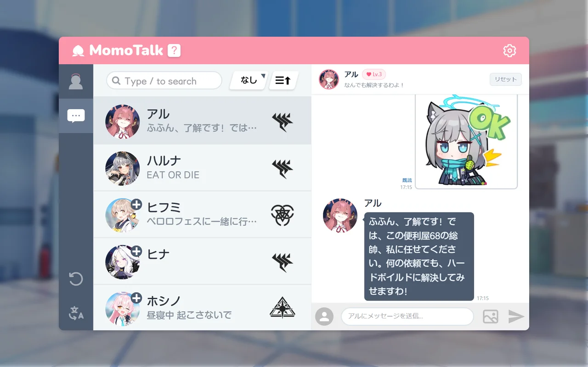

# MomoTalk AI 使用說明

MomoTalk AI 是一款還原《蔚藍檔案》MomoTalk 界面的沉浸式 AI 對話 Web 應用程式。借助現代大語言模型（LLM），老師可以與奇普托斯的 23 位學生展開即時、自然的深度互動。

---

## 📚 介面與功能

### 1. 學生列表（左側邊欄）
- **選擇學生**: 點選左側列表中的學生即可開啟專屬對話。
- **篩選與搜尋**:
  - **學院圖示**: 按學院（阿拜多斯、歌赫娜、三一、千禧年等）篩選學生。
  - **搜尋欄**（快速鍵 `/`）: 支援學生姓名、羅馬拼音、常用暱稱即時搜尋。
- **最新訊息預覽**: 列表直接展示每位學生的最新留言與回覆狀態。
- **睡眠狀態標記（💤）**: 學生處於就寢時間時，頭像右上角會亮起「💤」圖示。

### 2. 對話介面
- **發送訊息**: 在底部輸入框輸入內容後按 `Enter` 鍵發送。
  - 換行請按 `Shift + Enter`。
  - 使用輸入法確認候選字時按下的 `Enter` 不會發送訊息。
- **正在輸入動畫**: 老師發送訊息後，學生端會呈現逼真的「...」打字氣泡。
- **已讀標記（既読）**: 老師發送的訊息會在學生接收處理後標註「既読」。
- **多模態圖片辨識**:
  - 可點選輸入欄右側的圖片圖示選擇圖片，或直接貼上圖片（`Ctrl + V`）發送。
  - 學生具備視覺理解能力，能夠根據圖片內容結合自身人設給出個人化反應。
- **貼圖**: 點選輸入欄左側的圖示開啟貼圖列表，點選即可發送。可用下方的「1」「2」按鈕切換頁面。學生能理解貼圖的含義（「OK」「謝謝」、驚訝、害羞等）並做出相應回覆。
- **查看資料**: 點選聊天介面中的學生頭像（頂部或訊息旁）即可開啟該學生的資料頁。

### 3. 作息與睡眠模擬
- 每位學生均擁有符合原作設定的作息時間表（區分工作日/例假日起床時間，以及規律/熬夜作息）。
- **睡眠期間互動**:
  - 在學生睡眠期間發信，訊息會被留存；當學生在起床時間醒來後，會自動主動向老師發送回覆。
  - 該功能可在「設定」中隨時開啟或關閉。

### 4. 羈絆等級系統
- 經常與學生交流可提升好感度並提升羈絆等級（Kizuna Rank）。
- 升級時將播放原作經典的羈絆升級結算音效與動效。

### 5. 側邊欄底部操作
- **🌐 切換語言**: 支援繁體中文、簡體中文、日語、英語、韓語即時切換。
- **🧹 清空對話**: 點選聊天介面右上角的「重設」按鈕，可清除與該學生的聊天記錄（會彈出確認）。

---

## ⚙️ 系統設定（右上角齒輪）

點選右上角齒輪圖示可打開設定視窗：

1. **AI 服務商選擇**:
   - **Groq**（推薦・預設）: 極速推論，支援 `openai/gpt-oss-120b` 與 `qwen/qwen3.8-27b`。
   - **Google Gemini**: 谷歌多模態大模型。
   - **OpenAI 相容介面**: 接入任意相容第三方中轉或自訂模型。
   - **Anthropic Claude**: 卓越的敘事表達模型。
2. **作息模擬開關**: 自由啟用或停用學生睡眠作息機制。
3. **基本設定**: 音效開關與音量、全螢幕顯示、字體縮放、對話拖拽。

---

## 🌟 問題回報

如遇任何問題或有新功能建議，歡迎前往 GitHub 倉庫交流：

- 倉庫位址: [hirarara74/momotalk_AI](https://github.com/hirarara74/momotalk_AI)
- 提交反饋: [GitHub Issues](https://github.com/hirarara74/momotalk_AI/issues)

